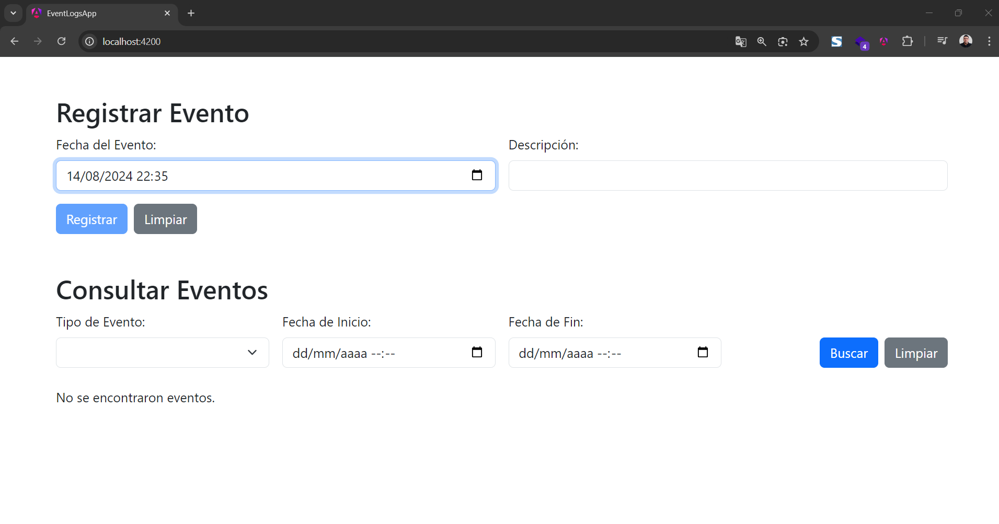

# EventLogsAPI

EventLogsAPI es un proyecto de gestión de eventos que incluye un backend desarrollado con .NET y un frontend desarrollado con Angular. La aplicación permite registrar eventos y consultar los eventos registrados utilizando varios filtros.



## Prerrequisitos

Antes de empezar, asegúrate de tener instalado lo siguiente:

- [Visual Studio 2022](https://visualstudio.microsoft.com/vs/)
- [.NET 6.0 SDK](https://dotnet.microsoft.com/download/dotnet/6.0)
- [Node.js y npm](https://nodejs.org/) (Versión 16 o superior)
- [Angular CLI](https://angular.io/cli) (instalado globalmente con `npm install -g @angular/cli`)

## Pasos para ejecutar la aplicación

### 1. Clonar el repositorio

git clone https://github.com/usuario/EventLogsAPI.git
cd EventLogsAPI

### 2. Ejecutar el Backend (.NET API)

#### 2.1 Restaurar paquetes de NuGet
Abre Visual Studio 2022 y carga la solución EventLogsAPI.sln. Luego, restaura los paquetes de NuGet necesarios:

```bash
dotnet restore 
```

#### 2.2 Crear y aplicar las migraciones de la base de datos
En la consola de administrador de paquetes (Package Manager Console) de Visual Studio, ejecuta:

```bash
Update-Database
```

#### 2.3 Ejecutar la API
Desde Visual Studio, selecciona la opción de iniciar el proyecto EventLogsAPI y ejecuta la aplicación. La API estará disponible en https://localhost:7136/api/EventLogs.

### 3. Ejecutar el Frontend (Angular App)

```bash
cd EventLogsApp
```

### 3.2 Instalar dependencias de npm
Ejecuta el siguiente comando para instalar las dependencias necesarias:

```bash
ng serve
```

La aplicación estará disponible en http://localhost:4200.

# Uso de la aplicación

### Registrar Eventos
En la sección de "Registrar Evento", puedes registrar nuevos eventos ingresando la fecha y la descripción del evento. La fecha por defecto es la fecha y hora actual del navegador. Al hacer clic en "Registrar", se guardará el evento y se mostrará un mensaje de confirmación.

### Consultar Eventos
En la sección "Consultar Eventos", puedes buscar eventos registrados aplicando filtros por tipo de evento y rango de fechas. Si no se especifican fechas, se devolverán todos los eventos del tipo seleccionado.

